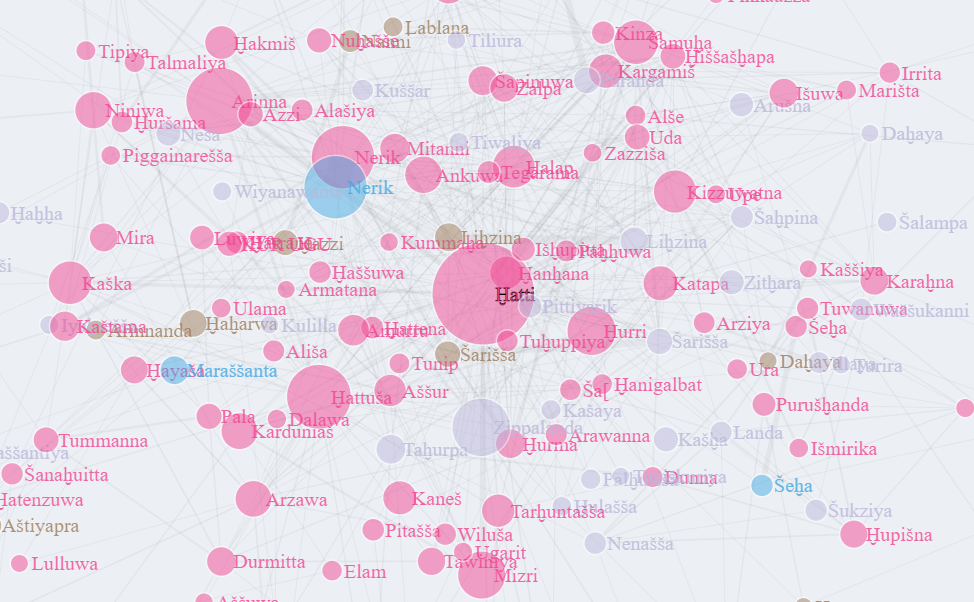

# NVHT: Network Visualization of Hittite Toponyms

Inspired by the [HiTop platform](https://www.hethport.uni-wuerzburg.de/HiTop/hetgeointro.php "HiTop: Hittite Toponyms"), this repository contains an R project which sources, cleans, and displays the HiTop database in an interactive network visualization using NetworkD3 and Shiny. The dashboard can be accessed [on shinyapps.io](https://veryeager.shinyapps.io/NVHT/ "NVHT by Asher Stout").

